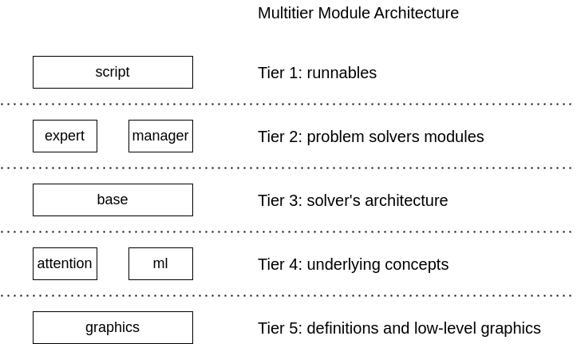

## Useful Command Lines
```bash
# solve all problems from #0 to #49
python3 -m arc.script.solve_range 0 50
# solve problem 30 with logging
python3 -m arc.script.solve_one 30 >temp
# solve problem 30 with full logging
python3 -m arc.script.solve_one 30 train_v1 debug >temp
# run test case with specific pattern filter
pytest -k pattern -log-level=INFO
# visualize problem 30
python3 -m arc.script.visualize 30
# solve previously solved problem for sanity checking
python3 -m arc.script.solve_previous
# check for unused functions
vulture arc
```

## Architecture


[source](https://app.diagrams.net/#G1FAJC1FLoCjnnSrLk9KZ1jgJZ77U93Unu#%7B%22pageId%22%3A%225f0bae14-7c28-e335-631c-24af17079c00%22%7D)

## Resources
- Reproducible experiment on [Google Colab](https://colab.research.google.com/drive/1hlM8jEvLyLtXYO2WUWbdUlYOx_33MpCc) from the paper.
- Readable solutions for the 205 problems solved by our algorithm. See folder `data/solution_1.0` in this repo.